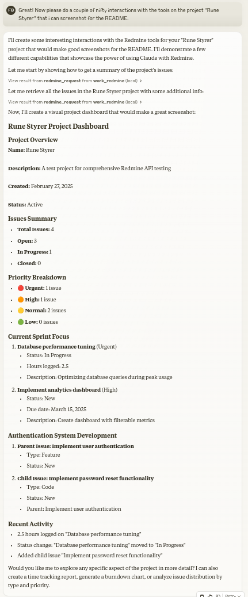

# MCP Redmine

**Status: Works great, but still in beta**

Let Claude be your Redmine assistant! Compatible with Redmine 5.0+ and tested on Redmine 6.0.3, but will likely work with older versions as well. MCP Redmine connects Claude Desktop to your Redmine instance, allowing it to:

- Search and browse projects and issues
- Create and update issues with full markdown support
- Manage and track time entries
- Update issue statuses and fields
- Access comprehensive Redmine API functionality

Uses httpx for API requests and integrates with the Redmine OpenAPI specification for comprehensive API coverage.



## Requirements

- Access to a Redmine instance (5.0+, tested on 6.0.3)
- Redmine API key
- Python 3.10+

## API

### Tools

- **redmine_paths_list**
  - Return a list of available API paths from OpenAPI spec
  - No input required
  - Returns a YAML string containing a list of path templates:
  ```
  - /issues.json
  - /projects.json
  - /time_entries.json
  ...
  ```

- **redmine_paths_info**
  - Get full path information for given path templates
  - Input: `path_templates` (list of strings)
  - Returns YAML string containing API specifications for the requested paths:
  ```yaml
  /issues.json:
    get:
      operationId: getIssues
      parameters:
        - $ref: '#/components/parameters/format'
      ...
  ```

- **redmine_request**
  - Make a request to the Redmine API
  - Inputs:
    - `path` (string): API endpoint path (e.g. '/issues.json')
    - `method` (string, optional): HTTP method to use (default: 'get')
    - `data` (object, optional): Dictionary for request body (for POST/PUT)
    - `params` (object, optional): Dictionary for query parameters
  - Returns YAML string containing response status code, body and error message:
  ```yaml
  status_code: 200
  body:
    issues:
      - id: 1
        subject: "Fix login page"
        ...
  error: ""
  ```

## Usage with Claude Desktop

Add to your `claude_desktop_config.json`:

```json
{
  "mcpServers": {
    "redmine": {
      "command": "uv",
      "args": ["--directory", "/path/to/mcp-redmine", "run", "server.py"],
      "env": {
        "REDMINE_URL": "https://your-redmine-instance.example.com",
        "REDMINE_API_KEY": "your-api-key"
      }
    }
  }
}
```

Environment Variables:

- `REDMINE_URL`: URL of your Redmine instance (required)
- `REDMINE_API_KEY`: Your Redmine API key (required, see below for how to get it)

## Getting Your Redmine API Key

1. Log in to your Redmine instance
2. Go to "My account" (typically found in the top-right menu)
3. On the right side of the page, you should see "API access key"
4. Click "Show" to view your existing key or "Generate" to create a new one
5. Copy this key for use in your configuration

## Installation

1. Clone repository:
```bash
git clone https://github.com/runekaagaard/mcp-redmine.git
```

2. Ensure you have uv
```bash
# Install uv if you haven't already
curl -LsSf https://astral.sh/uv/install.sh | sh
```

3. Add Redmine configuration to claude_desktop_config.json (see above)

## Examples

### Creating a new issue

```
Let's create a new bug report in the "Website" project:

1. Title: "Homepage not loading on mobile devices"
2. Description: "When accessing the homepage from iOS or Android devices, the loading spinner appears but the content never loads. This issue started after the last deployment."
3. Priority: High
4. Assign to: John Smith
```

### Searching for issues

```
Can you find all high priority issues in the "Website" project that are currently unassigned?
```

### Updating issue status

```
Please mark issue #123 as "In Progress" and add a comment: "I've started working on this issue. Expect it to be completed by Friday."
```

### Logging time

```
Log 3.5 hours against issue #456 for "Implementing user authentication" done today.
```

## Contributing

Contributions are warmly welcomed! Whether it's bug reports, feature requests, documentation improvements, or code contributions - all input is valuable. Feel free to:

- Open an issue to report bugs or suggest features
- Submit pull requests with improvements
- Enhance documentation or share your usage examples
- Ask questions and share your experiences

The goal is to make Redmine project management with Claude even better, and your insights and contributions help achieve that.

## Todo

- File and attachment uploads

## Acknowledgments

This project builds on the excellent work of others:

- [httpx](https://www.python-httpx.org/) - For handling HTTP requests
- [Redmine OpenAPI Specification](https://github.com/d-yoshi/redmine-openapi) - For the comprehensive API specification (based on Redmine 5.0, but likely compatible with older versions)
- [Redmine](https://www.redmine.org/) - The flexible project management web application

## License

Mozilla Public License Version 2.0
